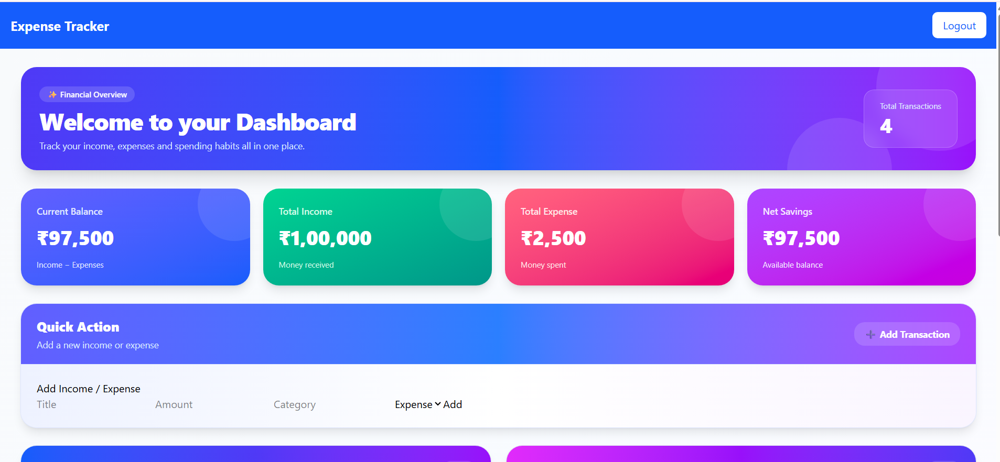
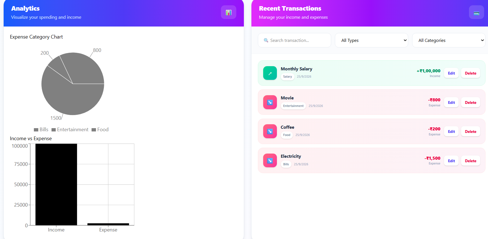

# 💰 Expense Tracker

A full-stack **MERN Stack Expense Tracker** that helps users manage their income and expenses with JWT-based authentication. The application supports adding, editing, deleting, searching, and filtering transactions while providing financial insights through an interactive dashboard and charts.

---

## 🚀 Features

### 🔐 Authentication

* User Registration
* Secure Login
* JWT-based Authentication
* Protected Dashboard Routes
* Password Hashing using bcrypt

### 💳 Income & Expense Management

* Add Income and Expenses
* Edit Transactions
* Delete Transactions
* Category-based Transaction Tracking
* User-specific Transaction Storage
* Input Validation
* Ownership-based Access Control

### 📊 Dashboard

* Current Balance
* Total Income
* Total Expense
* Net Savings
* Interactive Expense Analytics
* Income vs Expense Comparison
* Recent Transactions
* Quick Action for Adding Transactions

### 🔎 Search & Filter

* Search Transactions by Title or Category
* Filter by Income
* Filter by Expense
* Filter by Category
* Reset Filters

---

# 🛠️ Tech Stack

## Frontend

* React.js
* React Router DOM
* Tailwind CSS
* Axios
* Recharts
* Vite

## Backend

* Node.js
* Express.js
* MongoDB
* Mongoose
* JWT Authentication
* bcrypt
* CORS
* dotenv

## Testing

* Jest
* Supertest
* MongoDB Memory Server

---

# 📁 Project Structure

```text
Expense-Tracker
│
├── client
│   ├── public
│   ├── src
│   │   ├── api
│   │   │   └── api.js
│   │   ├── components
│   │   │   ├── AddExpense.jsx
│   │   │   ├── ExpenseChart.jsx
│   │   │   ├── Navbar.jsx
│   │   │   └── ProtectedRoute.jsx
│   │   ├── pages
│   │   │   ├── Dashboard.jsx
│   │   │   ├── Login.jsx
│   │   │   └── Register.jsx
│   │   ├── App.jsx
│   │   ├── index.css
│   │   └── main.jsx
│   └── package.json
│
├── server
│   ├── config
│   │   └── db.js
│   ├── controllers
│   │   ├── authController.js
│   │   └── expenseController.js
│   ├── middleware
│   │   └── authMiddleware.js
│   ├── models
│   │   ├── Expense.js
│   │   └── User.js
│   ├── routes
│   │   ├── authRoutes.js
│   │   └── expenseRoutes.js
│   ├── screenshots
│   │   ├── login.png
│   │   ├── register.png
│   │   ├── Dashboard1.png
│   │   └── Dashboard2.png
│   ├── tests
│   ├── .env.example
│   ├── app.js
│   ├── server.js
│   └── package.json
│
├── .gitignore
└── README.md
```
---

# 📸 Screenshots

## 🔐 Login


---

## 📝 Register


---

## 🏠 Dashboard



---

## 📊 Dashboard Analytics & Transactions



---

# ⚙️ Installation & Setup

## 1. Backend Setup

Navigate to the server directory:

```bash
cd server
```

Install the dependencies:

```bash
npm install
```

Create a `.env` file inside the `server` folder:

```env
PORT=5000
MONGO_URI=your_mongodb_connection_string
JWT_SECRET=your_secret_key
```

Start the backend server:

```bash
npm run dev
```

The backend will run on:

```text
http://localhost:5000
```

---

## 2. Frontend Setup

Open another terminal and navigate to the client directory:

```bash
cd client
```

Install the dependencies:

```bash
npm install
```

Start the frontend development server:

```bash
npm run dev
```

The frontend will run on:

```text
http://localhost:5173
```

---

# 🌐 Local URLs

### Frontend

```text
http://localhost:5173
```

### Backend

```text
http://localhost:5000
```

---

# 📡 API Endpoints

## Authentication

| Method | Endpoint             | Description         |
| ------ | -------------------- | ------------------- |
| POST   | `/api/auth/register` | Register a new user |
| POST   | `/api/auth/login`    | Login user          |

## Expenses

| Method | Endpoint            | Description                           |
| ------ | ------------------- | ------------------------------------- |
| GET    | `/api/expenses`     | Get authenticated user's transactions |
| POST   | `/api/expenses`     | Add a transaction                     |
| PUT    | `/api/expenses/:id` | Update a transaction                  |
| DELETE | `/api/expenses/:id` | Delete a transaction                  |

All expense endpoints require JWT authentication.

---

# 🧪 Testing

The backend includes automated tests using **Jest, Supertest, and MongoDB Memory Server**.

Run the tests from the `server` directory:

```bash
npm test
```

The test suite covers:

* Authentication middleware
* Token validation
* Adding transactions
* Retrieving user-specific transactions
* Updating transactions
* Deleting transactions
* Ownership protection

---

# 🔒 Security

The application includes:

* JWT-based authentication
* bcrypt password hashing
* Protected API routes
* User-specific transaction access
* Ownership checks for update and delete operations
* Environment variables for sensitive configuration
* Input validation for transaction data

---

# 🔮 Future Enhancements

* Export Expense Reports as PDF
* CSV Export
* Monthly Budget Planning
* Dark Mode
* Mobile Responsive Improvements
* Advanced Financial Analytics
* Cloud Deployment

---

# 👩‍💻 Author

**Varshini Samireddi**

* GitHub: https://github.com/varshinisamireddi114
* LinkedIn: https://www.linkedin.com/in/varshini-samireddi-21623832a
* Email: [varshinisamireddi@gmail.com](mailto:varshinisamireddi@gmail.com)

---

⭐ If you found this project useful, consider giving it a star!