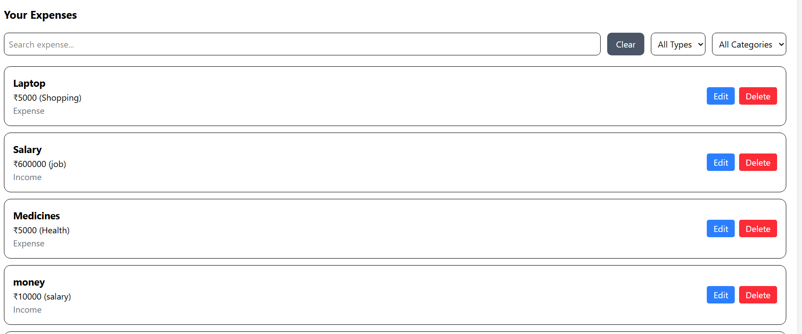
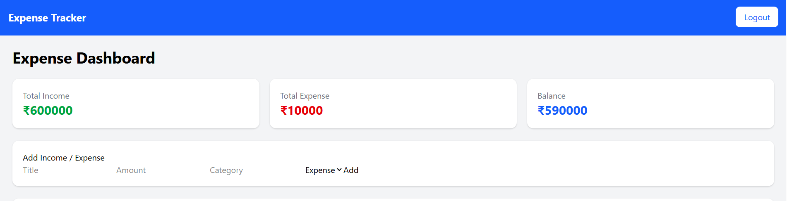
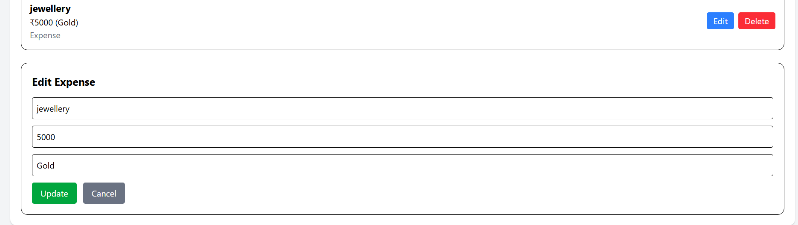

# 💰 Expense Tracker

A full-stack **MERN Stack Expense Tracker** that enables users to securely manage their income and expenses with JWT-based authentication. The application allows users to add, edit, delete, and categorize transactions while providing real-time financial insights through interactive charts.

---

## 🚀 Features

### 🔐 Authentication

- User Registration
- Secure Login
- JWT Authentication
- Protected Routes
- Password Hashing using bcrypt

### 💳 Expense Management

- Add Income & Expenses
- Edit Transactions
- Delete Transactions
- Category-based Expense Tracking
- User-specific Data Storage

### 📊 Dashboard

- Total Income
- Total Expense
- Current Balance
- Interactive Expense Charts
- Recent Transactions Overview

### 🔎 Search & Filter

- Search Transactions
- Filter by Income
- Filter by Expense
- Filter by Category

---

# 🛠️ Tech Stack

## Frontend

- React.js
- React Router DOM
- Tailwind CSS
- Axios
- Recharts

## Backend

- Node.js
- Express.js
- MongoDB
- Mongoose
- JWT Authentication
- bcrypt

---

# 📁 Project Structure

```text
Expense-Tracker
│
├── client
│   ├── src
│   │   ├── api
│   │   ├── assets
│   │   ├── components
│   │   ├── context
│   │   ├── pages
│   │   ├── utils
│   │   ├── App.jsx
│   │   └── main.jsx
│   ├── public
│   └── package.json
│
├── server
│   ├── config
│   ├── controllers
│   ├── middleware
│   ├── models
│   ├── routes
│   ├── screenshots
│   ├── utils
│   ├── server.js
│   └── package.json
│
├── .gitignore
└── README.md
```

---

# 📸 Screenshots

## 🏠 Dashboard



---

## ➕ Add Expense



---

## ✏️ Edit Expense



---

## 📊 Expense Analytics


---

# ⚙️ Installation & Setup

## Backend

Navigate to the server directory.

```bash
cd server
```

Install dependencies.

```bash
npm install
```

Create a `.env` file inside the `server` folder.

```env
PORT=5000
MONGO_URI=your_mongodb_connection_string
JWT_SECRET=your_secret_key
```

Start the backend server.

```bash
npm run dev
```

---

## Frontend

Open another terminal and navigate to the client directory.

```bash
cd client
```

Install dependencies.

```bash
npm install
```

Start the development server.

```bash
npm run dev
```

---

# 🌐 Local URLs

Frontend

```text
http://localhost:5173
```

Backend

```text
http://localhost:5000
```

---

# 📡 API Endpoints

## Authentication

| Method | Endpoint |
|--------|----------|
| POST | `/api/auth/register` |
| POST | `/api/auth/login` |

## Expenses

| Method | Endpoint |
|--------|----------|
| GET | `/api/expenses` |
| POST | `/api/expenses` |
| PUT | `/api/expenses/:id` |
| DELETE | `/api/expenses/:id` |

---

# 🔮 Future Enhancements

- Export Expense Reports as PDF
- CSV Export
- Monthly Budget Planning
- Dark Mode
- Mobile Responsive UI
- Advanced Analytics
- Cloud Deployment

---

# 👩‍💻 Author

**Varshini Samireddi**

- GitHub: https://github.com/varshinisamireddi114
- LinkedIn: https://www.linkedin.com/in/varshini-samireddi-21623832a
- Email: varshinisamireddi@gmail.com

---

⭐ If you found this project useful, consider giving it a star!